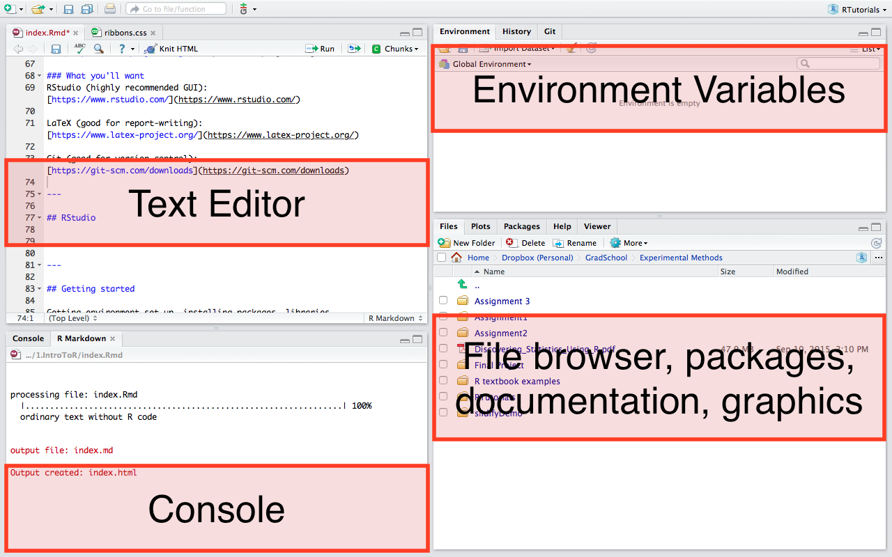

--- .intro-slide

## Introduction to R

   **Jenna Blumenthal**  
   MIE 1402

---

## What is R?

- Language & environment for statistical computing
- Widely used by statisticians, data miners
- Popular among academics & industry

---

## What is it used for?

- Data handling, organizing
- Basic mathematical operations
- Linear, nonlinear modeling, classical stats tests, time-series analysis, classification, clustering, etc
- Publication-quality graphics

---

## What makes R so great?

- Open source (i.e. free)
- Highly extensible (user-submitted **packages**)
  + Functions available for very specific areas
- Excellent documentation
- Great graphics
  + Publication-quality graphs (`ggplot2`)
  + RMarkdown, LaTeX (write reports without copying and pasting)
  + Shiny (interative data visualizations, etc.)
- Reproducible analysis

---

## What are some other options?

- SAS, SPSS, Stata, MATLAB, etc...
- Not so free
- Not so open-source (meaning there is a smaller community to help when you get stuck)

---

## Getting set up

### What you'll need

R: [http://www.r-project.org/](http://www.r-project.org/)

### What you'll want
RStudio (highly recommended GUI): [https://www.rstudio.com/](https://www.rstudio.com/)

LaTeX (good for report-writing): [https://www.latex-project.org/](https://www.latex-project.org/)

Git (good for version control): [https://git-scm.com/downloads](https://git-scm.com/downloads)

---

## RStudio



---

### Console
- Command-line interface
- Type after the `>` prompt and R will execute your command
- This is where R does the stuff
  
### Editor
- Collection of commands can be edited and saved
- `File --> New | File --> Open --> R Script`
  
### Environment
- What data/values R has in its memory
- Good for viewing complex objects
  
### Files, packages, docs, views
- Browse directory, open files, install/load packages, look at documentation (for help), preview graphs, etc.


---

## Getting started

Before you start being a stats wizard...get organized.

---

### 1. Working directory

- The folder you are currently in
- If you ask R to retrieve a certain file, it will look in the working directory (unless another path is given)
- If you save a file from R, it will save in your working directory (ditto)
- Be careful, sometimes you think you are in the correct wd, but you are not. Double check using:
  
```{r, eval=FALSE}
getwd()
```

You can change the working directory using 

```{r, eval=FALSE}
setwd("Desktop/ExperimentalMethods/RTutorials")
```

---

### 2. Install packages/load libraries

- The core of what makes R great
- Some useful ones come preloaded, but there are many more
- Andy Field will reference the ones he uses in the textbook


```{r eval=FALSE}
install.packages("package-name")
library(package-name)
```

#### Notes

- The first one uses quotes, the second doesn't. Don't ask me why.
- Often you figure out you don't have a package by getting an error.
- Check to see what packages you have installed using
```{r eval=FALSE}
library()
```
- You only have to **install** the package once, but you need to **load** the package every time you set up a new environment.

---

## Some basic examples

```{r}
1+1
```

```{r}
a = 4
a
```

```{r eval=FALSE}
fruit <- c("apples", "pears", "strawberries")
```


---

## Data

There are several ways to import data into your R environment:

```{r eval=FALSE}
# Built into R
read.csv()
read.delim()
read.table()

# rio package
library(rio)
import()

# Base datasets (often used in examples)
library(datasets)
mtcars
```

---

## Viewing , summarizing, etc

```{r eval=FALSE}
mtcars
View(mtcars)
head(mtcars)
```

```{r eval=FALSE}
mtcars[1,]
mtcars[,1]
mtcars$mpg # beacause mtcars is a dataframe!
```

---

### What is a dataframe?

Sort of like a spreadsheet in Excel, except more fun.
- header contains column names
- note, most functions like to work with dataframes, but others like matrices
- Similar, but different object type
- can generally coerce using
```{r eval=FALSE}
as.data.frame()
as.matrix()
```

---

### DIY Dataframe

Note, I rarely do this. Likely you will be pulling data from another source.

```{r}
metallicaNames <- c("Lars", "James", "Kirk", "Rob")
metallicaAges <- c(47, 47, 48, 46)
metallica_data <- data.frame(Name = metallicaNames, Age = metallicaAges)
```
```{r}
metallica_data$Age
mean(metallica_data$Age)
```

---

### Subsetting data

```{r}
metallica_data$Age >= 47

older_band_members <- metallica_data[metallica_data$Age >= 47,]

# OR use subset (a bit more intuitive)
older_band_members <- subset(metallica_data, Age >= 47)

```

---

## R Commander

- GUI interface
- If you are an SPSS user, it may feel more familiar
- I don't like it (it used to crash my computer)

---

## Saving

If you did some data manipulation and would like to save it as a new file:
```{r eval=FALSE}
write.table()
write.csv(metallica_data, "MetallicaData.csv") # note it will save in your wd
```

Save the R file, **DON'T** save the R workspace

Can also make a `project` - helpful for saving the working directory, dataframes, etc.

---

## Brief introduction to graphs and `ggplot2`

```{r}
hist(mtcars$mpg)
```

---

```{r}
plot(mtcars$mpg, mtcars$disp)
```

---

```{r eval=FALSE}
install.packages("ggplot2")
```

```{r message=FALSE}
library(ggplot2)
```


```{r}
plot <- ggplot(data = mtcars, aes(mpg, disp))
plot + geom_point()
```

---
```{r}
plot + geom_point() + ggtitle("This is my awesome graph")
```

Note that the `plot` object isn't updating unless it is reassigned

Read Ch 4 for some more examples.

---
## R Markdown

- instead of C+P-ing everything
- Write your report, generate results, insert graphs, etc. all in the same file
- A few hours of learning will save LOTS of time
- Turn your analyses into:
  + PDF
  + Word
  + Slides
  + HTML (like me!)
  + Interactive dashboard
- File --> New --> R Markdown (.Rmd file)
- To generate PDF files, you'll need LaTeX
  + Mac: http://www.tug.org/mactex/
  + Windows: http://miktex.org/
- We will go into syntax, etc in a future tutorial

---

## More resources

- Datacamp: datacamp.com/courses/free-introduction-to-r
- R Markdown: http://rmarkdown.rstudio.com/lesson-1.html
- The textbook is great

---
## References

Wikipedia:
[https://en.wikipedia.org/wiki/R_(programming_language)](https://en.wikipedia.org/wiki/R_(programming_language))

A (very) short introduction to R: 
[https://cran.r-project.org/doc/contrib/Torfs+Brauer-Short-R-Intro.pdf](https://cran.r-project.org/doc/contrib/Torfs+Brauer-Short-R-Intro.pdf)

Field A, Miles J, Field Z. Discovering Statistics Using R. London: Sage; 2012.

---


